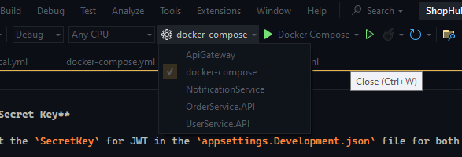

# ShopHub Microservices Project

This project consists of multiple microservices that communicate using RabbitMQ and are managed through Docker. Follow the steps below to set up and run the project.

## Prerequisites

- [.NET SDK 8](https://dotnet.microsoft.com/download) installed.
- [Docker](https://www.docker.com/products/docker-desktop) installed and running.
- [Visual Studio 2022](https://visualstudio.microsoft.com/vs/) (optional for running with Visual Studio).

## Setup

1. **Set the JWT Secret Key**

   You need to set the `SecretKey` for JWT in the `appsettings.Development.json` file for both `ApiGateway` and `UserService`.

   Generate a `SecretKey` using the following PowerShell command:

   ```
   [Convert]::ToBase64String((1..32 | ForEach-Object { (Get-Random -Maximum 256) }))
   ```

   Add the generated `SecretKey` to the following files:

   - `src/ApiGateway/appsettings.Development.json`
   - `src/UserService/UserService.API/appsettings.Development.json`

2. **Running the Project**

   You have two options to run the project:

   ### Option 1: Using Visual Studio 2022

   - Open the solution in Visual Studio 2022.
   - In the Startup Project dropdown, select `docker-compose`.
   - Click the play button to start the project.

   This will automatically open the Swagger page with the `Order` and `User` services.

   

   ### Option 2: Using PowerShell

   - Open PowerShell.
   - Navigate to the root directory of the project.
   - Run the following command:
     ```
     docker compose -f docker-compose.local.yml up --build -d
     ```
   - Wait for all the services to stabilize.

   Access the Swagger page at: [http://localhost:8080/swagger](http://localhost:8080/swagger)

## Services

- **ApiGateway:** Manages routing and authentication for other services.
- **OrderService:** Manages orders.
- **UserService:** Manages user registration and authentication.
- **NotificationService:** Listens to events from RabbitMQ and processes notifications.
- **RabbitMQ:** Message broker for event-driven communication between services.

## Viewing Notification Service Logs

To see the notification service in action, messages are logged to the console with information about the order ID and the user ID when a new order is created. You can view these messages by:

- Opening Docker Desktop.
- Navigating to the `notificationservice` logs to see the messages.

## Things to Improve

- **Validations:** Add necessary validations to ensure data integrity.
- **Centralized Authentication Service:** Configure an independent service for authentication to avoid adding the `SecretKey` to multiple projects and installing the same JWT dependencies across multiple microservices.
